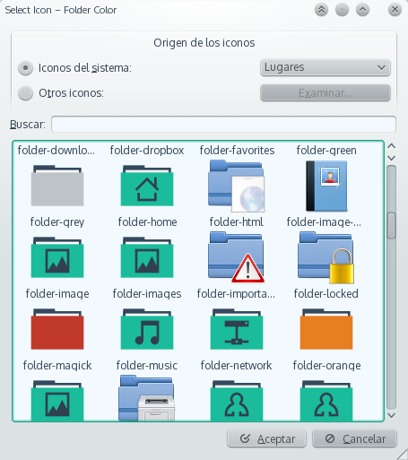

Dolphin Folder Color
====================
version 1.8.0

A KDE Service Menu for coloring the folders so fast, also has the ability to color a selected set of folders.
**Supports Plasma 5 and KDE4**

## Installation
You just need to run the script. **install.sh** with a click and restart dolphin.

## Screenshots
### Service Menu
 
### Custom Icon
 
